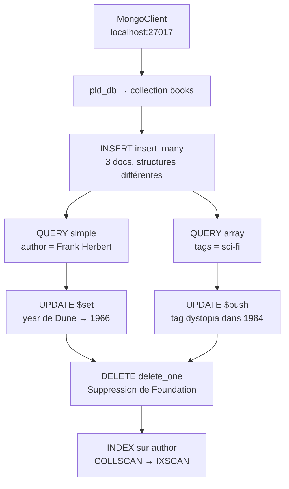

# POC MongoDB : le catalogue d'une librairie

PLD Alternative Data Models, Holberton School Toulouse.

Démonstration du modèle document avec MongoDB à travers un fil rouge librairie : insertion de livres aux structures différentes, recherches simple/imbriquée/tableau, mise à jour atomique avec `$set` et `$push`, suppression, et mesure de l'impact d'un index (COLLSCAN → IXSCAN). Le tout illustre l'idée centrale du cours : la persistance polyglotte, où chaque type de donnée va dans la base taillée pour son mode d'accès.

## Lancer le POC

```bash
docker run --name mongo -p 27017:27017 -d mongo:latest
pip3 install pymongo
python3 poc_mongodb.py
```

Si le conteneur existe déjà : `docker start mongo`.

## Contenu de poc_mongodb.py

1. **INSERT (schema flexible)** : trois livres avec des structures différentes — `Dune` a `tags` et `publisher`, `1984` n'a pas de `tags`, `Foundation` a un champ `series`. Ce que SQL ne peut pas faire sans colonnes nullable ou `ALTER TABLE`.
2. **QUERY simple** : `find({"author": "Frank Herbert"})` — requête par valeur exacte sur un champ scalaire.
3. **QUERY nested / array** : recherche d'un tag dans un tableau avec `find({"tags": "sci-fi"})` — aucune table de jointure nécessaire.
4. **UPDATE `$set`** : modification d'un seul champ (`year` de Dune) sans réécrire le document entier.
5. **UPDATE `$push`** : ajout d'un élément dans un tableau de façon atomique — `["sci-fi"]` devient `["sci-fi", "dystopia"]` pour 1984.
6. **DELETE + INDEX** : suppression ciblée, puis mesure COLLSCAN vs IXSCAN avec `explain("executionStats")`.

Résultat mesuré sur le bloc 6 : stage `COLLSCAN` sans index → stage `IXSCAN` avec index sur `author`.

## Diagramme Mermaid



## Fichiers

- `poc_mongodb.py` : le proof of concept, complet et fonctionnel
- `research_summary.md` : le research summary (livrable écrit, 1 à 2 pages)
- `presentation.key` / `presentation.pptx` : la présentation (10 slides, les 7 questions du sujet dans l'ordre)
- `README.md` : ce fichier
